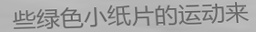

# Table of Content
[Introduction](#Introduction)
# Introduction
Generate text images for training deep learning OCR model (e.g. [CRNN](https://github.com/bgshih/crnn)).
Support both latin and non-latin text.

In this very specific version, we aim to use MNIST to synthesize images of texts with digits.

# How to install
- Ubuntu 16.04+
- python 3.5+

Install dependencies:
```
pip3 install -r requirements.txt
```
If using a combination of PyCharm and conda environment, most of packages would be installed automatically, except for opencv and easydict. In this circumstance, add these codes:
```
pip install opencv-python -y 
pip install easydict -y
```

# How to run in Linux Terminal

1. To see all optional arguments and their meanings.
```
python3 main.py --help
```

2. Config text effects and fraction in `configs/default.yaml` file. To use your own configs, create a new config file and run:
```
python3 main.py --config_file configs/*your_config*.yaml
```

Here are some examples:

|Effect name|Image|
|------------|----|
|Origin(Font size 25)||
|Perspective Transform||
|Random Crop||
|Curve||
|Light border||
|Dark border||
|Random char space big||
|Random char space small||
|Middle line||
|Table line||
|Under line||
|Emboss||
|Reverse color||
|Blur||
|Text color||
|Line color||

# How to generate with your own data
## Arrange your own data in corresponding folder
All you need to pay attention to is the 'data' folder. While generate digits with MNIST dataset, here the structure of our data folder:

data  
├── bg		# Backgrounds to added as noises  
├── chars  
├── corpus		# Words to generate sentences  
│├── train  
│└── val  
├── corpus_fixed_data  
│├── train  
│└── val  
├── corpus_handwritten  
├── fonts  
│├── chn  
│├── eng  
│├── jpn  
│└── jpn_v2  
├── fonts_list  
├── hand_corpus  
├── list_corpus  
└── MNIST		# Your dictionary of Characters : Images  
│├── 0  
│├── 1  
│├── 2  
│├── 3  
│├── 4  
│├── 5  
│├── 6  
│├── 7  
│├── 8  
│└── 9  

* **bg**: put your own background here to make output images more noisy.
* **corpus**: contains texts of sentence to generate images of those sentences.
* **MNIST**: presently, we are using MNIST, which was re-arranged beforehand. Replace MNIST folder by your own data with exactly mimicking the structure. 

## Edit your own config-yaml file
This code is using MNIST.yaml located in configs folder.

In case of using this code on your own data:
1. Duplicate MNIST.yaml then feel free to rename it.
2. Edit the last 03 parameters at the end of the file:
	* **char_folder**: path to folders of your mimicking-MNIST folder.
	* **char_label**: path to a csv of matching 'filename' - 'label'
	* **backgrounds**

# Demo
By default, simply run `python3 main.py` will generate 20 text images
and a labels.txt file in `output/default/`.




## Strict mode
For no-latin language(e.g Chinese), it's very common that some fonts only support
limited chars. In this case, you will get bad results like these:


Select fonts that support all chars in `--chars_file` is annoying.
Run `main.py` with `--strict` option, renderer will retry get text from
corpus during generate processing until all chars are supported by a font.

# Tools
You can use `check_font.py` script to check how many chars your font not support in `--chars_file`:
```bash
python3 tools/check_font.py

checking font ./data/fonts/eng/Hack-Regular.ttf
chars not supported(4971):
['第', '朱', '广', '沪', '联', '自', '治', '县', '驼', '身', '进', '行', '纳', '税', '防', '火', '墙', '掏', '心', '内', '容', '万', '警','钟', '上', '了', '解'...]
0 fonts support all chars(5071) in ./data/chars/chn.txt:
[]
```

# Generate image using GPU
If you want to use GPU to make generate image faster, first compile opencv with CUDA.
[Compiling OpenCV with CUDA support](https://www.pyimagesearch.com/2016/07/11/compiling-opencv-with-cuda-support/)

Then build Cython part, and add `--gpu` option when run `main.py`
```
cd libs/gpu
python3 setup.py build_ext --inplace
```

# Debug mode
Run `python3 main.py --debug` will save images with extract information.
You can see how perspectiveTransform works and all bounding/rotated boxes.


# Origin of codes
This code is based on Sanster's repo.
See https://github.com/Sanster/text_renderer
